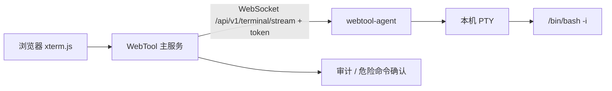
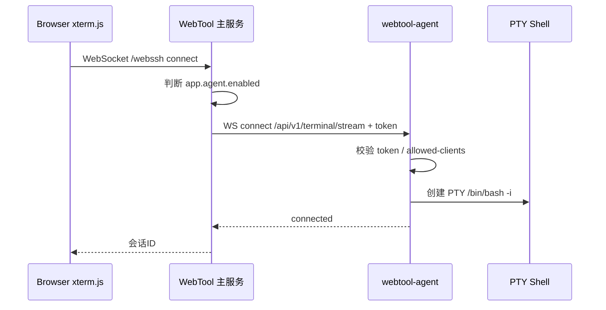
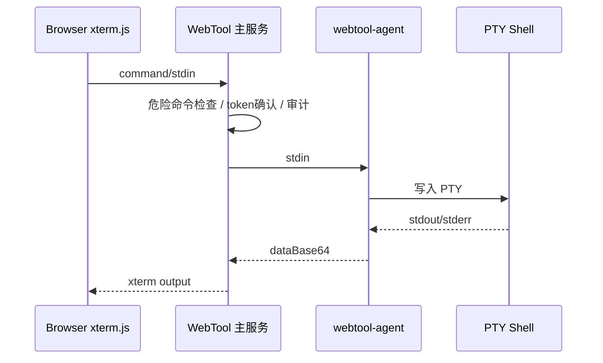
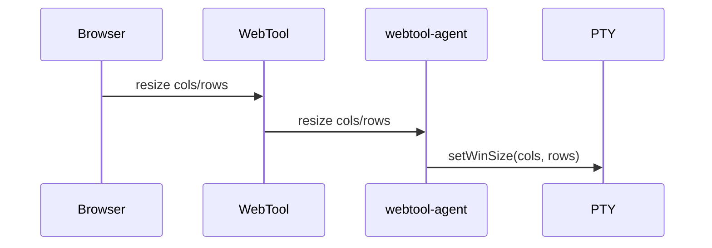
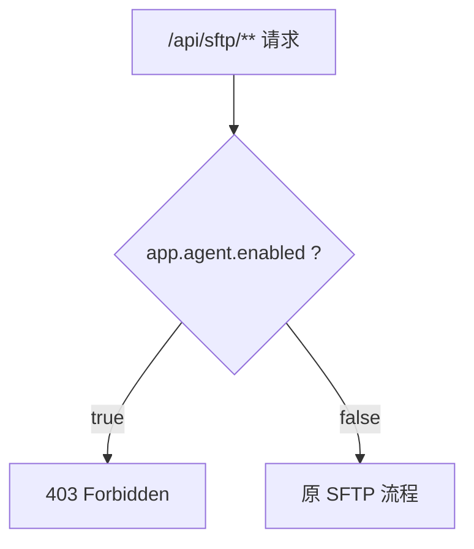

# WebTool Agent 模式部署与安全设计

## 1. 背景

传统模式下，WebTool 主服务直接使用 SSH/SFTP 连接目标服务器：

```text
浏览器 xterm.js -> WebTool 主服务 -> SSH/SFTP -> 目标服务器
```

这种方式需要 WebTool 主服务持有目标服务器账号密码，并由主服务发起 SSH 登录。部分安全规范会将其认定为中心平台直接登录生产服务器，存在合规风险。

Agent 模式将执行点前移到目标服务器本机：

```text
浏览器 xterm.js -> WebTool 主服务 -> HTTPS/WebSocket API -> webtool-agent -> 本机 PTY shell
```

WebTool 主服务不再直接 SSH 登录目标服务器，而是调用部署在目标服务器上的 `webtool-agent`。Agent 在本机创建 PTY 终端并执行命令。

## 2. 架构说明



### 2.1 组件职责

| 组件 | 职责 |
| --- | --- |
| 浏览器 xterm.js | 终端输入输出展示 |
| WebTool 主服务 | 用户登录、服务器列表、Agent 路由、危险命令确认、审计 |
| webtool-agent | 部署在目标服务器，本机创建 PTY shell，执行命令并回传输出 |
| PTY shell | 真实伪终端环境，支持 vim/top/mysql/su/sudo 等交互式程序 |

### 2.2 与传统 SSH 模式的区别

| 项目 | 传统 SSH 模式 | Agent 模式 |
| --- | --- | --- |
| 连接方式 | WebTool 主服务 SSH 到目标机 | WebTool 调用目标机 Agent API |
| 账号密码 | 主服务持有并用于 SSH 登录 | Agent 不再 SSH 登录本机 |
| 命令执行身份 | SSH 登录用户 | 启动 Agent 的系统用户 |
| 文件侧栏 SFTP | 可用 | Agent 模式下已禁用 |
| 合规边界 | 中心平台直接登录服务器 | 目标机本地受控 Agent 执行 |

## 3. 部署方式

### 3.1 构建 Agent 包

在项目根目录执行：

```bash
cd webtool-agent
mvn -q -DskipTests package
```

构建产物：

```text
webtool-agent/target/webtool-agent-1.0.0-SNAPSHOT.jar
```

### 3.2 目标服务器安装 JDK

`webtool-agent` 运行需要 JDK/JRE 11 或兼容运行环境。推荐使用 Eclipse Temurin JDK 11。

示例安装目录：

```bash
/opt/jdk/jdk-11.0.31+11
```

启动前确认：

```bash
java -version
```

### 3.3 部署 Agent

将 Agent 包放到目标服务器，例如：

```bash
mkdir -p /opt/webtool-agent
cp webtool-agent-1.0.0-SNAPSHOT.jar /opt/webtool-agent/
```

建议使用专用系统用户启动：

```bash
useradd -r -m webtool-agent
chown -R webtool-agent:webtool-agent /opt/webtool-agent
```

启动：

```bash
su - webtool-agent
java -jar /opt/webtool-agent/webtool-agent-1.0.0-SNAPSHOT.jar \
  --server.port=18080 \
  --agent.token=replace-with-strong-secret
```

> 测试阶段可以临时用 root 启动，但生产不建议 root 常驻运行 Agent。

### 3.4 Agent 配置

Agent 默认配置文件：

```text
webtool-agent/src/main/resources/application.yml
```

生产建议配置：

```yaml
server:
  port: 18080

agent:
  token: replace-with-strong-secret
  shell:
    linux: /bin/bash,-i
    windows: cmd.exe
  command:
    max-sessions: 20
    idle-timeout-seconds: 1800
  security:
    require-token: true
    allowed-clients:
      - 10.0.0.5   # WebTool 主服务 IP
```

`allowed-clients` 为空时不校验来源 IP。生产环境建议填写 WebTool 主服务 IP。

### 3.5 主服务配置

修改 WebTool 主服务 `application.yml`：

```yaml
app:
  agent:
    enabled: true
    port: 18080
    token: replace-with-strong-secret
```

配置含义：

| 配置 | 说明 |
| --- | --- |
| `enabled` | 是否启用 Agent 模式 |
| `port` | 目标服务器 Agent 监听端口 |
| `token` | WebTool 调用 Agent 时携带的共享密钥 |

Agent 地址由 WebTool 自动拼接：

```text
http://{服务器列表中的 host}:{app.agent.port}/api/v1/terminal/stream
```

例如服务器列表 host 为：

```text
10.238.89.11
```

`app.agent.port` 为：

```text
18080
```

最终连接：

```text
ws://10.238.89.11:18080/api/v1/terminal/stream
```

### 3.6 服务器列表配置

服务器列表无需增加 Agent 字段。继续维护原来的服务器 IP 即可。

Excel 或 YAML 中的 `host` 字段会被用来拼接 Agent 地址。

```yaml
server-groups:
  - name: Agent Servers
    servers:
      - name: demo-server
        host: 10.238.89.11
        port: 22
        username: appuser
        password: unused-in-agent-mode
```

Agent 模式开启后：

- `host` 用于拼 Agent 地址。
- `port/username/password` 不再用于 SSH 登录终端。
- 命令由目标服务器本机 Agent 执行。

## 4. 安全策略

### 4.1 Agent API 鉴权

Agent 默认要求 token：

```yaml
agent:
  security:
    require-token: true
```

调用链路：

```text
WebTool 主服务读取 app.agent.token
WebTool 主服务调用 Agent 时携带 token
Agent 校验 token
校验通过后才创建 PTY shell
```

注意：

- token 只保存在 WebTool 主服务和目标服务器 Agent 配置中。
- token 不下发浏览器。
- 前端 `terminal.html` 不再发送 `agentToken`。
- Agent 使用常量时间比较校验 token。

### 4.2 网络访问控制

Agent 端口必须限制来源。

建议：

1. Agent 只监听内网地址。
2. 防火墙或安全组只允许 WebTool 主服务 IP 访问 Agent 端口。
3. Agent 配置 `allowed-clients`。

示例：

```yaml
agent:
  security:
    allowed-clients:
      - 10.0.0.5
```

Linux 防火墙示例：

```bash
firewall-cmd --permanent --add-rich-rule='rule family="ipv4" source address="10.0.0.5" port protocol="tcp" port="18080" accept'
firewall-cmd --reload
```

### 4.3 运行用户控制

Agent 执行命令的权限等于启动 Agent 的系统用户权限。

推荐：

```text
低权限专用用户运行 Agent
必要的高权限命令通过 sudo 白名单授权
```

不推荐：

```text
生产环境 root 常驻运行 Agent
```

sudoers 示例：

```text
webtool-agent ALL=(root) NOPASSWD: /usr/bin/systemctl status *, /usr/bin/journalctl *, /usr/bin/tail, /usr/bin/cat, /usr/bin/grep
```

### 4.4 SFTP 禁用

Agent 模式下，原 SFTP 功能已禁用。

原因：

```text
如果终端走 Agent，但 SFTP 仍由 WebTool 主服务 SSH/SFTP 到目标机，
则仍然存在传统 SSH 直连通道，安全边界不完整。
```

当前处理：

- 前端 Agent 模式隐藏文件侧栏。
- 后端 `/api/sftp/**` 在 `app.agent.enabled=true` 时返回 `403 Forbidden`。

### 4.5 危险命令与审计

Agent 模式下仍由 WebTool 主服务做：

- 用户登录鉴权
- 命令审计
- 危险命令二次确认
- 会话心跳
- 终端 resize 转发

## 5. 实现流程图

### 5.1 终端连接流程



### 5.2 命令输入输出流程



### 5.3 Resize 流程



### 5.4 SFTP 禁用流程



## 6. 传统 SSH 安全问题如何被规避

### 6.1 原问题

传统模式：

```text
WebTool 主服务持有账号密码
WebTool 主服务直接 SSH/SFTP 登录目标服务器
```

风险：

- 中心服务保存大量服务器账号密码。
- 中心服务拥有直接登录服务器能力。
- SFTP/SSH 通道难以解释为本机受控执行。
- 一旦主服务泄露，影响所有目标服务器。

### 6.2 Agent 模式解决方式

Agent 模式：

```text
目标服务器本机运行受控 Agent
WebTool 主服务只调用 Agent API
Agent 本机创建 PTY shell
```

改进点：

- WebTool 不再通过 SSH 登录目标服务器。
- 执行权限由目标机 Agent 运行用户决定。
- Agent API 有 token 鉴权和来源 IP 限制。
- 原 SFTP 通道在 Agent 模式下被禁用。
- 危险命令确认和审计仍在 WebTool 主服务统一处理。

## 7. 验证步骤

### 7.1 检查 Agent 健康状态

从 WebTool 主服务机器执行：

```bash
curl http://10.238.89.11:18080/api/v1/health
```

预期：

```json
{
  "status": "UP",
  "agentId": "local-agent"
}
```

### 7.2 验证 token

如果 token 不一致，终端会显示：

```text
[Agent error] unauthorized agent request
[Agent closed] CloseStatus[code=1003, reason=unauthorized]
```

检查：

- WebTool 主服务 `app.agent.token`
- 目标服务器 Agent `agent.token`

两边必须一致。

### 7.3 验证终端

进入终端后执行：

```bash
whoami
pwd
top
vim test.txt
mysql --version
```

`whoami` 返回的是启动 Agent 的系统用户。

### 7.4 验证 SFTP 禁用

Agent 模式下访问：

```text
/api/sftp/home
/api/sftp/list
```

预期：

```text
403 Forbidden
```

## 8. 运维建议

1. 生产环境不要使用默认 token。
2. Agent 端口只允许 WebTool 主服务 IP 访问。
3. Agent 使用专用低权限用户运行。
4. 高权限操作通过 sudo 白名单授权。
5. 定期轮换 `app.agent.token` / `agent.token`。
6. 对 Agent 进程增加 systemd 托管和日志采集。
7. 若后续需要文件管理，应新增 Agent 文件 API，不要恢复主服务 SFTP 直连。

